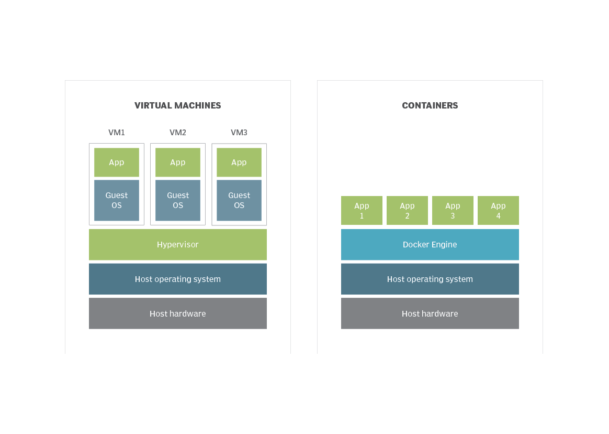

:revealjsdir: ../../node_modules/reveal.js
:revealjs_customtheme: ../../theme/vsfi.css
:revealjs_defaultTiming: 42
:icons: font

= Виртуальные машины, контейнеры

Сергей Ларченко

== Различие между контенером и виртуальной машиной

.Архитектура

== Виртуальные машины

- Полная изоляция ресурсов
- Эмуляция оборудования, полная или частичная
- Дополнительная абстракция над оборудованием
- Любые ОС
- Высокие накладные расходы
- Аппаратная виртуализация

=== Изоляция ресурсов

- Процессорное время
- Оперативная память
- Сеть
- Хранилище
- Эмулируемые устройства

=== Эмулация оборудования

- Кастомная или отличная от текущего CPU архитектура
- Сетевый интерфейсы
- Прочее экзотическое оборудоения

=== Аппаратная виртуализация

- Intel VT (VT-x VT-d)
- AMD-V

=== Паравиртуализация

- Необходимо готовить гостевую ОС
- Меньше накладных расходов

== Контейнеры

- Частичная изоляция ресурсов
- БОльшая утилизация утилизация ресурсов
- Низкие накладные расходы
- Небольшой выбор гостевых OC
- Виртуализация на уровне ОС
 
=== Виртуализация на уровне ОС

- cgroups
- xhyve
- hyper-v

=== Примеры ПО

* Docker
* containerd
* LXC/LXD
* OpenVZ
* CRI-O
* systemd-nspawn

== Управление виртуальными машинами

== Функции

- Контоль и управление жизненным циклом
- Менеджмент ресурсов
- Менеджмент сетей
- Менеджмент хранилища

== Примеры ПО

* libvirt
** oVirt
** OpenStack
** KubeVirt
* firecracker
* VMWare vSphere
* Hyper-V
** SCVMM

=== libvirt

Тулкит для управления множеством платформ виртуализации:
- QEMU
- LXC
- VZ
- etc

Работает на Linux

=== libvirt

- Управление квотами
- Живая миграция
- Локальное и общее хранилище
- Управление сетью
- управление жизненным циклом машины
- Управление виртуальным и физическим оборудованием

=== firecracker

Создан для создания microVM на базе KVM.

- быстрый запуск VM
- Требует модифицированное ядро для гостеовй ос
- Минимальный набор виртуального оборудования

